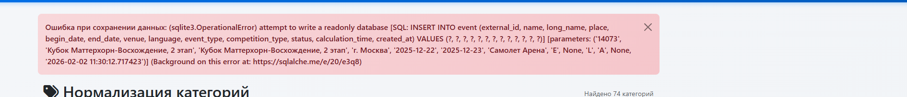

# Система управления турнирами по фигурному катанию

Веб-приложение для импорта, хранения и отображения данных соревнований по фигурному катанию на основе формата ISUCalcFS.

## 📋 Содержание

- [Описание](#описание)
- [Возможности](#возможности)
- [Технологии](#технологии)
- [Установка](#установка)
- [Конфигурация](#конфигурация)
- [Использование](#использование)
- [Архитектура базы данных](#архитектура-базы-данных)
- [Импорт данных](#импорт-данных)
- [Администрирование](#администрирование)
- [Разработка](#разработка)

---

## Описание

Система предназначена для:
- Импорта данных соревнований из XML файлов формата ISUCalcFS
- Хранения информации о спортсменах, клубах, тренерах, соревнованиях
- Отображения результатов и протоколов соревнований
- Генерации PDF протоколов
- Аналитики и статистики по соревнованиям

**Формат данных:** ISUCalcFS 3.7.6 (правила ISU сезона 2021-2022)

---

## Возможности

### Основной функционал
- ✅ Импорт XML файлов из ISUCalcFS
- ✅ Парсинг данных о соревнованиях, категориях, участниках
- ✅ Поддержка одиночного катания, пар и танцев на льду
- ✅ Хранение оценок судей (GOE) с правильным декодированием
- ✅ Отображение результатов и протоколов
- ✅ Генерация PDF протоколов
- ✅ Поиск по спортсменам, клубам, тренерам
- ✅ Аналитика и статистика

### Административные функции
- 🔐 Админ-панель с аутентификацией
- 📤 Импорт XML файлов через веб-интерфейс
- 📊 Экспорт данных в Google Sheets
- 🔄 Пересоздание базы данных
- 📈 Анализ бесплатного катания
- 🏆 Управление разрядами спортсменов

---

## Технологии

### Backend
- **Flask 2.3.3** - веб-фреймворк
- **SQLAlchemy 2.0.23** - ORM
- **Flask-Migrate 4.0.5** - миграции БД
- **Flask-CORS 4.0.0** - CORS поддержка
- **Flask-Limiter 3.5.0** - rate limiting
- **Redis 5.0.1** - хранилище для rate limiting
- **ReportLab 4.0.7** - генерация PDF
- **gspread 6.0.0** - интеграция с Google Sheets

### База данных
- **SQLite** (по умолчанию для разработки)
- **PostgreSQL** (для production)

### Frontend
- HTML/CSS/JavaScript
- Bootstrap (через шаблоны)

---

## Установка

### Требования
- Python 3.8+
- Redis (опционально, для production)
- PostgreSQL (опционально, для production)

### Шаги установки

1. **Клонирование репозитория**
```bash
git clone <repository-url>
cd calc.figurebase.ru
```

2. **Создание виртуального окружения**
```bash
python -m venv .venv
source .venv/bin/activate  # Linux/Mac
# или
.venv\Scripts\activate  # Windows
```

3. **Установка зависимостей**
```bash
pip install -r requirements.txt
```

4. **Настройка переменных окружения**
Создайте файл `.env` в корне проекта:
```bash
# База данных
DATABASE_URL=sqlite:///instance/figure_skating.db

# Админ-панель
ADMIN_USERNAME=admin
ADMIN_PASSWORD=your_secure_password

# Безопасность
SECRET_KEY=your_secret_key_here

# Логирование
LOG_LEVEL=INFO
LOG_FILE=logs/app.log

# Загрузка файлов
UPLOAD_FOLDER=uploads
MAX_CONTENT_LENGTH=16777216

# Redis (опционально, для production)
REDIS_URL=redis://localhost:6379/0

# Сессии
SESSION_TIMEOUT=3600
SESSION_COOKIE_SECURE=0  # 1 для HTTPS
```

5. **Создание базы данных**
```bash
python scripts/create_database.py
```

6. **Запуск приложения**
```bash
# Для разработки
python app.py

# Для production (с Gunicorn)
gunicorn -w 4 -b 0.0.0.0:5000 wsgi:app
```

---

## Конфигурация

### Переменные окружения

| Переменная | Описание | По умолчанию |
|------------|----------|--------------|
| `DATABASE_URL` | URL базы данных | `sqlite:///figure_skating.db` |
| `ADMIN_USERNAME` | Имя пользователя админ-панели | `admin` |
| `ADMIN_PASSWORD` | Пароль админ-панели | - |
| `SECRET_KEY` | Секретный ключ Flask | генерируется автоматически |
| `LOG_LEVEL` | Уровень логирования | `INFO` |
| `LOG_FILE` | Путь к файлу логов | `logs/app.log` |
| `UPLOAD_FOLDER` | Папка для загрузки файлов | `uploads` |
| `REDIS_URL` | URL Redis для rate limiting | не используется |
| `SESSION_TIMEOUT` | Таймаут сессии (секунды) | `3600` |

### Настройка Redis

Для production рекомендуется использовать Redis для rate limiting. Подробная инструкция в [docs/REDIS_SETUP.md](docs/REDIS_SETUP.md).

**Быстрая установка:**
```bash
# Ubuntu/Debian
sudo apt install redis-server
sudo systemctl start redis-server

# В .env
REDIS_URL=redis://localhost:6379/0
```

---

## Использование

### Веб-интерфейс

После запуска приложение доступно по адресу `http://localhost:5000`

**Основные страницы:**
- `/` - главная страница
- `/athletes` - список спортсменов
- `/clubs` - список клубов
- `/coaches` - список тренеров
- `/events` - список соревнований
- `/categories` - список категорий
- `/analytics` - аналитика

**Админ-панель:**
- `/admin` - вход в админ-панель
- `/admin/upload` - загрузка XML файлов
- `/admin/export-google-sheets` - экспорт в Google Sheets

### API

**Основные endpoints:**
- `GET /api/athletes` - список спортсменов
- `GET /api/athletes/<id>` - данные спортсмена
- `GET /api/athletes/<id>/performance-details` - детали выступлений
- `GET /api/clubs` - список клубов
- `GET /api/events` - список соревнований
- `GET /api/categories` - список категорий

---

## Архитектура базы данных

### Основные таблицы

#### Event (Соревнования)
- Информация о турнирах
- Связь с категориями и участниками

#### Category (Категории)
- Возрастные группы и дисциплины
- Типы: Singles (S), Pairs (P), Dance (D)
- Уровни: мастера (m), разряды (1, 2, 3)

#### Athlete (Спортсмены)
- Данные спортсменов
- Поддержка одиночников и пар
- Дедупликация по `external_id` или имени+дате рождения

#### Club (Клубы)
- Информация о клубах/школах
- Связь со спортсменами

#### Coach (Тренеры)
- Данные тренеров
- Связь со спортсменами

#### Participant (Участники)
- Связь спортсменов с категориями
- Результаты по сегментам

#### Performance (Выступления)
- Детальные результаты выступлений
- Элементы с оценками судей
- Компоненты программы

#### Element (Элементы)
- Детали элементов выступлений
- Оценки судей (GOE) в виде кодов 0-15
- Базовая стоимость и итоговый балл

### Схема связей

```
Event
 ├── Category
 │    ├── Segment
 │    │    ├── Performance
 │    │    │    └── Element (с оценками судей)
 │    │    └── JudgePanel
 │    └── Participant
 │         └── Athlete
 │              ├── Club
 │              └── Coach
```

Подробная документация по структуре БД: [docs/ISUCalcFS_DATABASE_GUIDE.md](docs/ISUCalcFS_DATABASE_GUIDE.md)

---

## Импорт данных

### Формат XML файлов

Система импортирует XML файлы формата ISUCalcFS версии 3.7.6.

**Структура XML:**
```xml
<ISUCalcFS>
  <Event>
    <Categories_List>
      <Category>
        <Segments_List>
          <Segment>
            <Participants_List>
              <Participant>
                <Person_Couple_Team>
                  <Team_Members>  <!-- Для пар -->
                    <Person/>
                  </Team_Members>
                  <Club/>
                </Person_Couple_Team>
                <PlannedElements/>
              </Participant>
            </Participants_List>
            <Performance_List>
              <Performance/>  <!-- Результаты выступлений -->
            </Performance_List>
          </Segment>
        </Segments_List>
      </Category>
    </Categories_List>
  </Event>
</ISUCalcFS>
```

### Процесс импорта

1. **Загрузка XML файла** через админ-панель (`/admin/upload`)
2. **Парсинг данных:**
   - События и категории
   - Участники (одиночники, пары, танцы)
   - Клубы и тренеры
   - Результаты выступлений
   - Элементы с оценками судей
3. **Дедупликация:**
   - Спортсмены по `external_id` или имени+дате рождения
   - Клубы по названию
   - Тренеры по имени
4. **Сохранение в БД**

### Декодирование GOE (Grade of Execution)

Оценки судей хранятся в XML как коды 0-15 и декодируются при чтении:

| Код | GOE | Формула | Описание |
|-----|-----|---------|----------|
| 0 | -5 | -5 | Очень плохое исполнение |
| 1-7 | -3 до +3 | code - 4 | Основная шкала |
| 8 | +4 | +4 | Отличное исполнение |
| 9 | None | None | Не используется |
| 10 | +5 | +5 | Превосходное исполнение |
| 11 | -5 | code - 16 | Альтернативное кодирование |
| 12 | -4 | code - 16 | Альтернативное кодирование |
| 13 | +4 | code - 9 | Альтернативное кодирование |
| 14 | +5 | code - 9 | Альтернативное кодирование |
| 15 | -1 | code - 16 | Альтернативное кодирование |

**Важно:** Оценки судей хранятся в БД как коды (0-15), декодирование происходит при чтении через API.

Подробная документация: [docs/GOE_DECODING.md](docs/GOE_DECODING.md)

### Особенности парсинга

#### Одиночники vs Пары
- **Одиночники:** `PCT_TYPE="PER"`, данные в `<Person_Couple_Team>`
- **Пары/Танцы:** `PCT_TYPE="COU"`, данные в `<Team_Members>` с двумя `<Person>`

#### Клубы
- У одиночников: данные в `<Club>` внутри `<Person_Couple_Team>`
- У пар: `<Club>` часто пустой, используется `PAR_CLBID` из `<Participant>`
- **Важно:** Не перезаписывать данные клуба пустыми значениями!

#### Дедупликация спортсменов
- Приоритет 1: `PCT_EXTDT` (внешний ID)
- Приоритет 2: Имя + Фамилия + Дата рождения
- При повторном появлении: мерж данных (не перезапись!)

Подробная документация: [docs/ISUCalcFS_PARSER_GUIDE.md](docs/ISUCalcFS_PARSER_GUIDE.md)

---

## Администрирование

### Пересоздание базы данных

Если нужно пересоздать БД (например, после исправления формулы декодирования GOE):

1. **Резервное копирование**
```bash
cp instance/figure_skating.db instance/figure_skating.db.backup.$(date +%Y%m%d_%H%M%S)
```

2. **Остановка приложения**
```bash
sudo systemctl stop calc-figurebase
```

3. **Удаление старой БД**
```bash
rm instance/figure_skating.db
```

4. **Создание новой БД**
```bash
python scripts/create_database.py
```

5. **Импорт XML файлов** через админ-панель

6. **Запуск приложения**
```bash
sudo systemctl start calc-figurebase
```

Подробная инструкция: [docs/DATABASE_RECREATION.md](docs/DATABASE_RECREATION.md)

### Исправление прав доступа к БД

Если возникает ошибка `sqlite3.OperationalError: attempt to write a readonly database`:

```bash
# Определить пользователя gunicorn
ps aux | grep gunicorn | grep calc.figurebase

# Исправить права (для www-data)
chown www-data:www-data instance/figure_skating.db
chown www-data:www-data instance/
chmod 664 instance/figure_skating.db
chmod 775 instance/
```

### Проверка данных

**SQL запрос для проверки оценок судей:**
```sql
SELECT 
    e.id,
    e.order_num,
    e.executed_code,
    json_extract(e.judge_scores, '$.J01') as j01_code,
    json_extract(e.judge_scores, '$.J02') as j02_code,
    json_extract(e.judge_scores, '$.J03') as j03_code
FROM element e
WHERE e.judge_scores IS NOT NULL
LIMIT 10;
```

Ожидаемый результат: `j01_code`, `j02_code`, `j03_code` должны быть числами от 0 до 15 (или NULL для кода 9).

---

## Разработка

### Структура проекта

```
calc.figurebase.ru/
├── app_factory.py          # Фабрика Flask приложения
├── config.py               # Конфигурация
├── models.py               # Модели БД
├── extensions.py          # Расширения Flask
├── routes/                 # Маршруты
│   ├── public.py          # Публичные страницы
│   ├── admin.py           # Админ-панель
│   ├── api.py             # API endpoints
│   └── analytics.py       # Аналитика
├── parsers/               # Парсеры XML
│   └── isu_calcfs_parser.py
├── services/              # Бизнес-логика
│   ├── import_service.py
│   ├── athlete_registry.py
│   ├── club_registry.py
│   └── pdf_generator.py
├── utils/                 # Утилиты
│   ├── normalizers.py
│   ├── formatters.py
│   └── auth.py
├── scripts/               # Скрипты
│   └── create_database.py
├── templates/             # HTML шаблоны
├── static/                # Статические файлы
└── docs/                  # Документация
```

### Миграции БД

```bash
# Создание миграции
flask db migrate -m "описание изменений"

# Применение миграций
flask db upgrade

# Откат миграции
flask db downgrade
```

### Тестирование

```bash
# Запуск тестов (если есть)
pytest

# Проверка кода
flake8 .
black --check .
```

### Логирование

Логи сохраняются в файл, указанный в `LOG_FILE` (по умолчанию `logs/app.log`).

**Уровни логирования:**
- `DEBUG` - детальная отладочная информация
- `INFO` - общая информация о работе
- `WARNING` - предупреждения
- `ERROR` - ошибки
- `CRITICAL` - критические ошибки

---

## Документация

### Основные документы

- [DATABASE_RECREATION.md](docs/DATABASE_RECREATION.md) - Инструкция по пересозданию БД
- [GOE_DECODING.md](docs/GOE_DECODING.md) - Расшифровка GOE оценок
- [ISUCalcFS_DATABASE_GUIDE.md](docs/ISUCalcFS_DATABASE_GUIDE.md) - Полная структура БД ISUCalcFS
- [ISUCalcFS_PARSER_GUIDE.md](docs/ISUCalcFS_PARSER_GUIDE.md) - Руководство по парсингу XML
- [ISUCalcFS_XML_GUIDE.md](docs/ISUCalcFS_XML_GUIDE.md) - Формат XML файлов
- [REDIS_SETUP.md](docs/REDIS_SETUP.md) - Настройка Redis

### Формат данных ISUCalcFS

**Версия программы:** 3.7.6  
**Правила сезона:** 2021-2022  
**Версия структуры БД:** 11149  
**Кодировка:** UTF-8 (XML), CP1251 (DBF)

### Ключевые особенности

1. **Кодирование GOE:** Оценки судей кодируются числами 0-15, декодируются по специальной формуле
2. **Бонус за вторую половину:** Прыжковые элементы во второй половине программы получают +10% к базовой стоимости
3. **Дедупликация:** Спортсмены объединяются по `external_id` или имени+дате рождения
4. **Клубы:** Данные клубов могут быть в разных местах XML, требуется правильная обработка

---

## Производственное развертывание

### Systemd сервис

Создайте файл `/etc/systemd/system/calc-figurebase.service`:

```ini
[Unit]
Description=Figure Skating Calculator Web Application
After=network.target

[Service]
User=www-data
Group=www-data
WorkingDirectory=/var/www/calc.figurebase.ru
Environment="PATH=/var/www/calc.figurebase.ru/.venv/bin"
Environment="DATABASE_URL=sqlite:///instance/figure_skating.db"
Environment="REDIS_URL=redis://localhost:6379/0"
ExecStart=/var/www/calc.figurebase.ru/.venv/bin/gunicorn -w 4 -b 127.0.0.1:5000 wsgi:app
Restart=always

[Install]
WantedBy=multi-user.target
```

**Управление сервисом:**
```bash
sudo systemctl start calc-figurebase
sudo systemctl stop calc-figurebase
sudo systemctl restart calc-figurebase
sudo systemctl status calc-figurebase
```

### Nginx конфигурация

```nginx
server {
    listen 80;
    server_name calc.figurebase.ru;

    location / {
        proxy_pass http://127.0.0.1:5000;
        proxy_set_header Host $host;
        proxy_set_header X-Real-IP $remote_addr;
        proxy_set_header X-Forwarded-For $proxy_add_x_forwarded_for;
        proxy_set_header X-Forwarded-Proto $scheme;
    }

    location /static {
        alias /var/www/calc.figurebase.ru/static;
    }
}
```

### Резервное копирование

**Автоматическое резервное копирование БД:**
```bash
#!/bin/bash
BACKUP_DIR="/var/backups/calc-figurebase"
DATE=$(date +%Y%m%d_%H%M%S)
mkdir -p $BACKUP_DIR
cp /var/www/calc.figurebase.ru/instance/figure_skating.db $BACKUP_DIR/figure_skating_$DATE.db
# Хранить последние 30 дней
find $BACKUP_DIR -name "figure_skating_*.db" -mtime +30 -delete
```

---

## Troubleshooting

### Проблемы с импортом XML

**Ошибка: "Не удалось распарсить XML"**
- Проверьте формат файла (должен быть UTF-8)
- Проверьте структуру XML (должен соответствовать ISUCalcFS)
- Проверьте логи: `tail -f logs/app.log`

**Ошибка: "Дубликаты спортсменов"**
- Проверьте логику дедупликации в `services/athlete_registry.py`
- Используйте скрипты для проверки дубликатов: `scripts/list_duplicates.py`

### Проблемы с БД

**Ошибка: "attempt to write a readonly database"**
- Проверьте права доступа к файлу БД
- Убедитесь, что пользователь gunicorn имеет права на запись

**Ошибка: "Database locked"**
- Проверьте, не запущено ли несколько процессов одновременно
- Перезапустите приложение

### Проблемы с Redis

**Ошибка: "Connection refused"**
- Проверьте, что Redis запущен: `sudo systemctl status redis-server`
- Проверьте URL в `REDIS_URL`
- Проверьте firewall: `sudo ufw status`

---

## Лицензия

[Указать лицензию]

## Авторы

[Указать авторов]

## Контакты

[Указать контакты]

---

**Версия документации:** 1.0  
**Дата обновления:** Январь 2026
