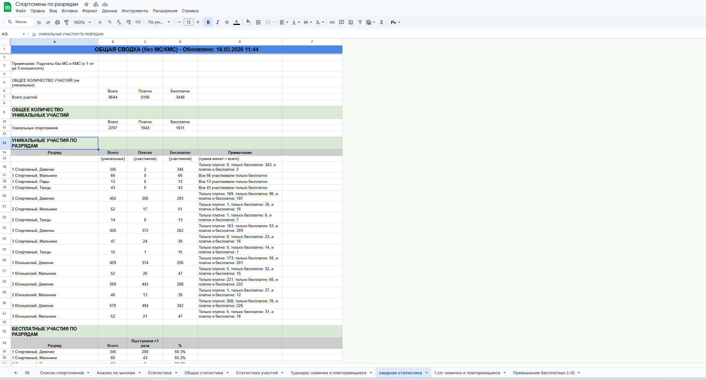
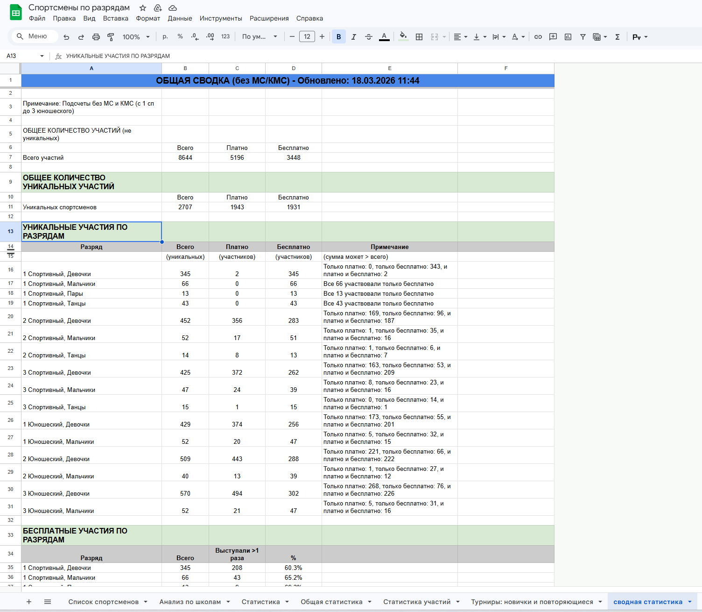

## Полный цикл работы с XML ISUCalcFS в calc.figurebase.ru

Этот документ объединяет воедино всё, что относится к **парсингу XML ISUCalcFS и загрузке данных в базу** в проекте `calc.figurebase.ru`: от структуры исходного файла до конечных записей в таблицах БД и экранов админки.

---

## 1. Откуда берётся XML и как он попадает в приложение

- **Источник файла**: программа `ISUCalcFS 3.7.6` (экспорт "Файл → Экспорт → XML"), формат описан в `docs/ISUCalcFS_XML_GUIDE.md`.
- **Кто загружает**: администратор через веб‑страницу `Загрузка XML файла турнира` (`templates/upload.html`).
- **HTTP‑маршруты**:
  - `routes/admin.py`, `@admin_bp.route('/upload')` — загрузка и первичная валидация XML, сохранение файла(ов) на диск и в сессию (`session['uploaded_files']`).
  - `@admin_bp.route('/analyze-xml')` — анализ XML без записи в БД (используется `ISUCalcFSParser` и `analyze_categories_from_xml`).
  - `@admin_bp.route('/import-xml')` (ниже по файлу) — окончательный импорт в БД через `save_to_database`.
- **Хранилище файлов**: каталог `UPLOAD_FOLDER` из `current_app.config`; имена файлов нормализуются `secure_filename` и дополняются timestamp + случайным суффиксом, чтобы избежать коллизий.
- **Промежуточные данные в сессии**:
  - `uploaded_files`: список словарей `{filepath, filename, saved_filename}` по всем успешно загруженным XML.
  - `parser_data`: результат анализа категорий и сводной статистики по уже распарсенным файлам (количество событий, категорий, участников и т.д.).

---

## 2. Высокоуровневый пайплайн: от XML до БД

1. **Загрузка файла(ов)** в `/upload`:
   - при `POST`:
     - из `request.files.getlist('file')` отбираются только `*.xml`;
     - каждый файл временно сохраняется на диск;
     - проверяется, что это валидный XML (`ET.parse(filepath)`), иначе файл удаляется;
     - в `session['uploaded_files']` записывается список успешно сохранённых файлов.
2. **Анализ XML** (`/analyze-xml`):
   - для каждого файла из `session['uploaded_files']`:
     - создаётся `ISUCalcFSParser(filepath)`;
     - вызывается `parser.parse()` — внутри последовательно заполняются списки `events`, `categories`, `segments`, `persons`, `clubs`, `participants`, `performances`, `judges`, `judge_panels`;
     - `services.rank_service.analyze_categories_from_xml(parser)` строит разбор категорий и нормализованные разряды;
     - результат по всем файлам складывается в `session['parser_data']`.
3. **Импорт XML в БД** (`/import-xml`):
   - снова используется `ISUCalcFSParser` и его `parse()` для выбранного файла;
   - результат парсинга передаётся в `services.import_service.save_to_database(parser)`;
   - `save_to_database` в одной транзакции создаёт:
     - запись `Event`,
     - все `Category`, `Segment`,
     - регистрирует/обновляет `Club`, `Coach`, `Athlete`,
     - создаёт/обновляет `Participant`, `Performance`, `Element`, `ComponentScore`, `Judge`, `JudgePanel`, `CoachAssignment`;
   - в конце вызывается `db.session.commit()` (при ошибке — `rollback` и исключение).

---

## 3. Структура и декодирование исходного XML (ISUCalcFS)

Подробная расшифровка формата дана в `docs/ISUCalcFS_XML_GUIDE.md` и `docs/ISUCalcFS_PARSER_GUIDE.md`. Ниже — ключевые моменты, которые используются парсером и импортом.

- **Корень**: `<ISUCalcFS>`.
- **Основная иерархия**:
  - `<Event>` — турнир (соревнование), атрибуты `EVT_*` (название, место, даты, статус и т.д.).
  - `<Category>` — категория/разряд, атрибуты `CAT_*` (пол, тип `S/D/P`, уровень `1/2/3/m`, количество заявленных, стартовавших и т.д.).
  - `<Segment>` — сегмент программы (КП/ПП/РТ), атрибуты `SCP_*` (названия, тип `S/F/R`, фактор, статусы, факторы PCS и пр.).
  - `<Participants_List>` → `<Participant>`:
    - ссылки `PCT_ID`, `CAT_ID`, `EVT_ID`;
    - итоговые места и баллы `PAR_TPLACE`, `PAR_TPOINT`;
    - статусы по сегментам `PAR_STAT1-6` и прочие поля.
  - `<Person_Couple_Team>`:
    - общие данные спортсмена/пары: ФИО, дата рождения, пол, клуб, тренеры, музыка и т.п. (`PCT_*`);
    - для одиночников `PCT_TYPE="PER"`, для пар/танцев — `PCT_TYPE="COU"`;
    - для пар дополнительно блок `<Team_Members>` с двумя `<Person>` (подробно в `ISUCalcFS_PARSER_GUIDE.md`).
  - `<Club>` — клуб/школа, тоже через `PCT_*` атрибуты.
  - `<Performance>` — выступление в сегменте:
    - общие поля `PRF_*` (TES, PCS, TSS, статусы, стартовый номер, вычеты);
    - детальный набор атрибутов для элементов `PRF_E..` и компонентов `PRF_C..`.

Ключевые особенности:

- **Все числовые оценки хранятся умноженными на 100**, делятся на 100 при интерпретации.
- **Даты** идут в виде `YYYYMMDD`, преобразуются в `date` через `datetime.strptime(..., '%Y%m%d')`.
- **GOE/оценки судей** кодируются целыми 0–15 и декодируются через функцию `_decode_judge_score_xml` (см. ниже).
- Поле `PCT_GENDER` ненадёжно для пар и судей, поэтому пол/тип дисциплины определяются в основном по `CAT_GENDER` + `CAT_TYPE`.
- Для бесплатных выступлений используется атрибут `PCT_PPNAME` у `Person_Couple_Team`, который парсер подтягивает в `participant['pct_ppname']`.

---

## 4. Класс `ISUCalcFSParser` (модуль `parsers/isu_calcfs_parser.py`)

Основная задача класса — прочитать XML и разложить его в **плоские структуры** (списки словарей), удобные для дальнейшего маппинга в БД.

- **Конструктор**:
  - принимает `xml_file_path`;
  - инициализирует пустые списки: `events`, `categories`, `segments`, `persons`, `clubs`, `participants`, `performances`, `judges`, `judge_panels`.

- **Метод `parse()`**:
  1. `ET.parse(self.xml_file_path)` + `getroot()`;
  2. последовательно вызывает:
     - `_parse_events(root)`
     - `_parse_categories(root)`
     - `_parse_segments(root)`
     - `_parse_judges(root)`
     - `_parse_persons(root)`
     - `_parse_clubs(root)`
     - `_parse_participants(root)`
     - `_parse_performances(root)`
  3. логирует сводную статистику по количеству распарсенных сущностей;
  4. при любой ошибке пишет её в лог и пробрасывает исключение.

Ниже — детализация по каждому из приватных методов.

### 4.1 `_parse_events(root)`

- Обходит все узлы `.//Event`.
- Каждому событию строит словарь `event_data`:
  - `id`, `name`, `long_name`, `place`, `venue`, `language`, `event_type`, `competition_type`, `status`, `calculation_time`, `external_id`.
  - даты:
    - `begin_date` и `end_date` через `_parse_date(EVT_BEGDAT/EVT_ENDDAT)`;
    - если начало отсутствует, но есть конец — начало принудительно ставится в конец.
- Нормализация строк: через `utils.normalizers.normalize_string` (в т.ч. чистка лишних пробелов/табов, см. `ISUCalcFS_PARSER_GUIDE.md`).
- Результат добавляется в `self.events`.

### 4.2 `_parse_categories(root)`

- Идёт по `.//Category`.
- Важная часть: **нормализация названия и исправление латиницы**:
  - `category_name = normalize_string(category.get('CAT_NAME'))`;
  - затем `fix_latin_to_cyrillic(category_name)` для исправления букв, набранных латиницей.
- Формирует словарь `category_data`:
  - `id`, `name`, `short_name`, `event_id`, `gender`, `type` (дисциплина `S/D/P`), `status`, `external_id`, `level`, `num_entries`, `num_participants`.
- Кладёт словарь в `self.categories`.

### 4.3 `_parse_segments(root)`

- Обходит `.//Segment`.
- Дополнительно извлекает **факторы компонентов PCS**:
  - для `idx` от 1 до 5 читает `SCP_CRFR{idx:02d}`;
  - корректно делит на 100 и складывает в `component_factors` (dict `idx → float`).
- На каждый сегмент создаётся `segment_data`:
  - `id`, `name`, `tv_name`, `short_name`, `category_id`, `type`, `factor`, `status`, `external_id`, `component_factors`.
- Результат попадает в `self.segments`.

### 4.4 `_wug_to_role_code(wug)` и `_parse_judges(root)`

- `_wug_to_role_code` — вспомогательная функция, которая переводит числовые WUG‑коды из `SCP_WUGxx` в роль судьи:
  - `6 → 'REF'`, `7 → 'TC'`, `8 → 'DO'`, `9 → 'TS'`, `10 → 'ATS'`.
- `_parse_judges`:
  - для каждого `Segment` ищет `<Judges_List>` и внутри все `<Person>`;
  - собирает уникальных судей (`seen_judges` по `PCT_ID`) в `self.judges`:
    - `id`, `external_id`, имя/фамилия в разных форматах, пол, страна, город, квалификация;
  - параллельно формирует записи `self.judge_panels`:
    - `segment_id`, `category_id`, `judge_id`, `role_code`, `panel_group`, `order_num`;
    - роль берётся либо из `SCP_WUGxx` (приведённого через `_wug_to_role_code`), либо из `PCT_AFUNCT`.

### 4.5 `_parse_persons(root)`

- Идёт по `.//Participants_List//Person_Couple_Team`.
- Определяет тип записи `person_type = PCT_TYPE`:
  - `PER` — одиночник;
  - `COU` — пара/танцы.
- Базовый `person_data` содержит:
  - идентификаторы, внешние ID, тип, национальность, клуб (`PCT_CLBID`), дату рождения, пол, полное имя из XML (`PCT_CNAME`), тренера, музыку КП/ПП, а также набор полей для дальнейшей нормализации ФИО (full/short/first/last/patronymic с вариантами кириллица/капс).
- Для `PER`:
  - имя, фамилия, отчество и их капс‑варианты берутся из `PCT_GNAME`, `PCT_FNAMEC/FNAME`, `PCT_TLNAME/TLNAMEC`;
  - главное отображаемое имя для протоколов — `PCT_PLNAME`;
  - короткое имя — `PCT_PSNAME`.
- Для `COU`:
  - имя пары, фамилия, короткое имя и т.д. читаются из `PCT_CNAME`, `PCT_PSNAME`, `PCT_PLNAME`;
  - пол принудительно ставится `'P'` (пара), чтобы не полагаться на `PCT_GENDER`.
- Каждая запись добавляется в `self.persons`.

### 4.6 `_parse_clubs(root)`

- Проходит по `.//Club`.
- Через множество `seen_clubs` избегает дубликатов по `PCT_ID`.
- Пропускает пустые/безымянные клубы: если нет `PCT_ID` или нет осмысленного названия (`PCT_PLNAME` или `PCT_CNAME`).
- Формирует `club_data`:
  - `id`, `external_id`, `name`, `short_name`, `country`, `city`.
- Результаты идут в `self.clubs`.
- Дополнительные подводные камни и правила для клубов (приоритет источников, защита от перезаписи пустыми `<Club/>`) подробно разобраны в `docs/ISUCalcFS_PARSER_GUIDE.md`, раздел 10.

### 4.7 `_parse_participants(root)`

- Обходит `.//Participant`.
- Для каждого `Participant`:
  - берёт `PCT_ID` и ищет соответствующий `Person_Couple_Team` через XPath `root.find('.//Person_Couple_Team[@PCT_ID="..."]')`;
  - если найден — читает `PCT_PPNAME` и сохраняет его в `pct_ppname` (используется далее для определения бесплатных выступлений, например `pct_ppname == 'БЕСП'`).
- Поля `participant_data`:
  - `id`, `external_id`, `category_id`, `person_id`, `bib_number`, итоговое место и баллы, ID клуба, `pct_ppname`, статусы по сегментам.
- Список `self.participants` становится основой для таблицы `Participant` в БД.

### 4.8 `_parse_performances(root)`

- Сначала строится `segment_factors` на основе уже распарсенных `self.segments` (чтобы найти фактор PCS для конкретного сегмента).
- Затем по каждому `.//Performance`:
  - собирается список `elements` (элементы E01–E20):
    - коды запланированного/нормализованного/исполненного элемента (`PRF_PNAE`, `PRF_PNWE`, `PRF_INAE`, `PRF_XNAE`);
    - подтверждение, временной код, базовая стоимость, штраф, результат;
    - словарь `judge_scores` с кодами оценок судей `PRF_E{idx}J{jidx}`, а также вспомогательными полями `half` и `wbp` (половина программы и бонус 10%).
    - GOE в элементе на этом этапе вычисляется только как `result - base_value` (если возможно), а **сырые коды оценок судей сохраняются как есть**, чтобы можно было позже изменять формулу декодирования без переимпорта.
  - собирается список `components` (PCS‑компоненты C01–C05):
    - тип компонента (`CO`, `TR`, `PR`, `IN`, `SK`) через `component_map`;
    - фактор PCS для компонента из `segment_factors`;
    - оценки судей `PRF_C{cidx}J{jidx}`, штрафы и итоговые результата.
  - вычеты `deductions`:
    - если `PRF_DEDTOT` отсутствует, считается суммой `PRF_DED01-17` (игнорируя некорректные значения).
  - итоговый `performance_data`:
    - базовая информация о выступлении (сегмент, участник, место, баллы TES/PCS, статусы и пр.);
    - списки `elements` и `components`.
- Все записи добавляются в `self.performances`.

### 4.9 Декодирование дат и GOE

- `_parse_date` — конвертация строки `YYYYMMDD` в `datetime.date`.
- `_decode_goe_xml` и `_decode_judge_score_xml` — функции из `ISUCalcFS_XML_GUIDE.md` и `GOE_DECODING.md`, реализующие точное соответствие кодов 0–15 значениям GOE от −5 до +5.
- Важный момент: **эти функции не используются напрямую в импорте** — в БД сохраняются сырые коды, а декодирование выполняется при чтении/анализе, чтобы можно было менять формулу без переимпорта.

---

## 5. Модуль `services.import_service.save_to_database(parser)`

Функция `save_to_database` отвечает за **единый атомарный импорт** результатов парсинга в PostgreSQL (или другую SQL‑БД через SQLAlchemy).

### 5.1 Защита от дубликатов турниров

- Берётся первый распарсенный `event_data = parser.events[0]`.
- Дата начала приводится к `date` через `utils.date_parsing.parse_date`.
- Выполняется поиск существующего события:
  - `Event.query.filter_by(name=event_name, begin_date=event_begin_date).first()`.
- Если такой турнир уже есть, выбрасывается `ValueError` с понятным сообщением; таким образом, один и тот же XML нельзя загрузить дважды.

### 5.2 Создание `Event`

- Создаётся объект `Event` (см. `models.Event`):
  - `external_id`, `name`, `long_name`, `place`, `begin_date`, `end_date`, `venue`, `language`, `event_type`, `competition_type`, `status`, `calculation_time`.
- Добавляется в сессию, вызов `db.session.flush()` — чтобы получения `event.id` использовать дальше как внешний ключ.

### 5.3 Импорт клубов через `ClubRegistry`

- Для всех `parser.clubs`:
  - используется `services.club_registry.ClubRegistry.register(club_data)`:
    - отвечает за **нормализацию и дедупликацию клубов** (объединение похожих названий, защита от перезаписи пустыми значениями и пр., подробно в `ISUCalcFS_PARSER_GUIDE.md`);
  - в `club_mapping` записывается соответствие `xml_id → db_id`.
- После регистрации вызывается `club_registry.merge_all_duplicates()`:
  - автоматически сливает дубликаты клубов;
  - при наличии изменений делает `db.session.commit()` и логирует количество объединённых записей.

### 5.4 Инициализация `CoachRegistry`

- Создаётся `CoachRegistry()`, который:
  - умеет создавать/искать тренера по имени;
  - используется при импорте `Participant` и создании `CoachAssignment` (история переходов спортсменов между тренерами).

### 5.5 Импорт категорий (`Category`)

- Строится `category_mapping` `xml_id → db_id`.
- Для каждой `category_data` из `parser.categories`:
  - вычисляется `normalized_name`:
    - если уже есть в данных — используется оно;
    - иначе вызывается `services.rank_service.normalize_category_name(name, gender)`;
  - создаётся `Category`:
    - `external_id`, `event_id`, `name`, `tv_name`, `normalized_name`, `num_entries`, `num_participants`, `level`, `gender`, `category_type`, `status`;
  - запись добавляется в БД и `flush` для получения `id`.

### 5.6 Импорт сегментов (`Segment`)

- Строится `segment_mapping` `xml_id → db_id`.
- Для каждого `segment_data` из `parser.segments`:
  - создаётся `Segment`:
    - `category_id` по `category_mapping`,
    - `name`, `tv_name`, `short_name`, `segment_type`, `factor`, `status`;
  - добавляется в сессию и `flush`.

### 5.7 Импорт судей и связки `JudgePanel`

- На основании `parser.judges`:
  - ищутся существующие судьи по (`first_name`, `last_name`, `full_name_xml`);
  - если не найден — создаётся новый `Judge`;
  - соответствие `xml_id` → `judge.id` записывается в `judge_mapping`.
- По всем `parser.judge_panels`:
  - через `segment_mapping` и `category_mapping` подставляются реальные `segment_id`, `category_id`;
  - если связка `(segment_id, judge_id)` уже существует — пропускается (защита от дубликатов);
  - иначе создаётся новый `JudgePanel` с ролью, группой и порядковым номером.

### 5.8 Импорт спортсменов (`Athlete`) и участников (`Participant`)

- Инициализируется `AthleteRegistry()`:
  - отвечает за **дедупликацию спортсменов** между файлами и турнирами (подробнее в `services/athlete_registry.py` и `ISUCalcFS_PARSER_GUIDE.md`).
- Строится `category_gender_map` по `parser.categories` (`xml_cat_id → gender`).
- Для каждого `participant_data` в `parser.participants`:
  1. Ищется соответствующий `person_data` по `person_id` (PCT_ID); если не найден — запись пропускается.
  2. Определяется пол спортсмена:
     - базовое значение — `person_data['gender']`;
     - если это одиночник (`person_data['type'] == 'PER'`), пол можно уточнить по `category_gender_map`.
  3. Определяется клуб:
     - сначала по `person_data['club_id']`, если есть маппинг в `club_mapping`;
     - иначе по `participant_data['club_id']`.
  4. Подготавливаются очищенные ФИО с помощью `utils.normalizers.remove_duplication` для имени, фамилии, отчества (сначала вариант `*_cyrillic`, потом обычный).
  5. Определяется приоритетное полное имя `full_name_xml`:
     - сначала `person_data['full_name']` (PCT_PLNAME — имя для протоколов, без дублей);
     - иначе `person_data['full_name_xml']`.
  6. Формируется `athlete_payload`:
     - `external_id`, `first_name`, `last_name`, `patronymic`, `full_name_xml`, `birth_date`, `gender`, `country`, `club_id`.
  7. Через `athlete_registry.get_or_create(athlete_payload)` создаётся или находится `Athlete` (с учётом логики дедупликации: по внешнему ID, ФИО+дате рождения и пр.).
  8. По `(event.id, category_id, athlete.id)` ищется существующий `Participant`:
     - если нет:
       - создаётся новый `Participant`:
         - `external_id`, `event_id`, `category_id`, `athlete_id`, `bib_number`, `total_points`, `total_place`, все статусы по сегментам, `pct_ppname`, `coach`;
     - если есть:
       - аккуратно **дозаполняются** поля, если в БД они пусты (чтобы не затереть уже имеющиеся данные);
       - обновляется тренер, если в XML пришло новое имя.

### 5.9 Обработка тренеров и переходов (`Coach` и `CoachAssignment`)

- Для каждого участника:
  - из `person_data['coach']` берётся строка с именами тренеров;
  - через `coach_registry.get_or_create(coach_name)` находится или создаётся `Coach`;
  - дата события берётся из `event.begin_date` либо `event.end_date`;
  - дальше:
    - если уже есть `CoachAssignment` с тем же `coach_id` и `event_id`/`athlete_id` — ничего не создаётся;
    - если есть текущий `is_current=True` тренер, и он отличается от нового — текущий переводится в завершённый (`end_date`, `is_current=False`), создаётся новый `CoachAssignment` с `is_current=True`;
    - если текущего назначения нет — создаётся первая запись назначения тренера.

### 5.10 Импорт выступлений (`Performance`, `Element`, `ComponentScore`)

- Для каждого `performance_data` в `parser.performances`, у которого `participant_id` совпадает с текущим XML‑`participant_data['id']`:
  1. Находится `segment_id` по `segment_mapping`.
  2. Пытается найти уже существующий `Performance` по `(participant.id, segment_id)`:
     - если нет:
       - создаётся новый `Performance`:
         - `participant_id`, `segment_id`, `index` (стартовый номер), `status`, `qualification`, времена (`start_time`, `duration`, `judge_time` через `parse_time`), место, баллы TES/PCS и др.;
         - поле `judge_scores` заполняется **одним JSON‑объектом**:
           - `elements` — список элементов из `performance_data['elements']`;
           - `components` — список компонентов;
           - `meta` — служебная информация (start_group, performance_index, locked, tes_sum, pcs_sum, tech_target, points_needed_*).
       - после `flush()` есть `performance.id`.
       - создаются объекты `Element` для каждого элемента:
         - в `judge_scores` элемента добавляются дополнительные поля `planned_norm`, `confirmed`, `time_code` (если они есть);
         - числовые поля (`base_value`, `goe_result`, `penalty`, `result`) аккуратно приводятся к `int` или оставляются `None`.
       - создаются объекты `ComponentScore` для каждого компонента:
         - `component_type`, `factor`, `judge_scores`, `penalty`, `result`.
     - если `Performance` уже был:
       - мягко до‑заполняются только пустые поля (`status`, `qualification`, `place`, `points`), не создаются новые элементы/компоненты (защита от повторного импорта).

### 5.11 Завершение транзакции

- После обработки всех сущностей:
  - выполняется `db.session.commit()`;
  - при любой ошибке — `db.session.rollback()` и исключение наружу (обрабатывается маршрутом админки, показывая ошибку пользователю).

---

## 6. Связь с моделями БД (`models.py`) и типовыми запросами

После импорта данные становятся доступны как обычные SQLAlchemy‑модели:

- `Event` — турнир; связи:
  - `categories = relationship('Category', backref='event')`;
  - `participants = relationship('Participant', backref='event')`.
- `Category` — разряд/категория:
  - `participants` (через `Participant.category_id`);
  - `segments` (через `Segment.category_id`).
- `Athlete`, `Club`, `Coach`, `CoachAssignment` — справочники и история.
- `Participant`:
  - связывает `Event`, `Category`, `Athlete`;
  - содержит статусы, итоговые места, баллы, `pct_ppname` (в т.ч. `'БЕСП'` — бесплатные участия).
- `Performance`, `Element`, `ComponentScore` — детали выступлений.
- `Judge`, `JudgePanel` — судьи и их роли.

Примеры использования в коде:

- В публичных роутингах (`routes/public.py`) применяется:
  - фильтрация и сортировка турниров, выборка по разрядам и месяцам;
  - агрегация участников по событиям/категориям;
  - использование `Participant.pct_ppname` для отчётов по бесплатным выступлениям.
- Аналитика и отчёты (модули `services/rank_service.py`, `routes/analytics.py`, шаблоны `free_participation*.html`) строят статистику по разрядам, клубам, количеству стартов, бесплатным участиям и др., опираясь на те же таблицы.

---

## 7. Где смотреть дополнительную информацию

- `docs/ISUCalcFS_XML_GUIDE.md` — полная расшифровка **XML формата ISUCalcFS** (структура, поля, формулы).
- `docs/ISUCalcFS_PARSER_GUIDE.md` — детальный гид по **парсингу участников, пар, клубов, дедупликации и подводным камням**.
- `docs/ISUCalcFS_DATABASE_GUIDE.md` — описание оригинальной **DBF‑базы ISUCalcFS** и её соответствия полям XML.
- `parsers/isu_calcfs_parser.py` — актуальная реализация парсера, на которую опирается импорт.
- `services/import_service.py` — реальный код импорта, описанный в этом документе пошагово.

